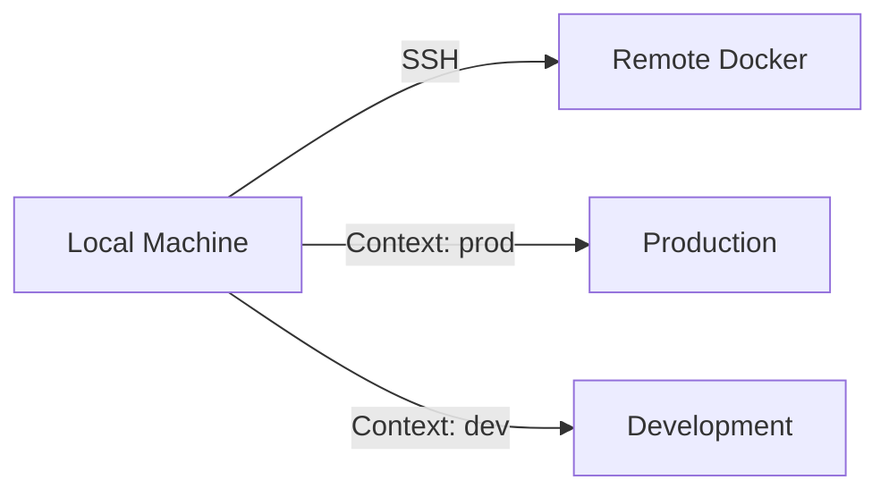

# Content Strategy Review: clews.id.au

**Review Date:** November 13, 2025
**Reviewed By:** Senior Content Strategist
**Site:** https://clews.id.au
**Overall Content Score: 6/10**

This blog features high-quality, authentic content with a strong personal voice. However, it suffers from inconsistent publishing, lack of content organization, and missed monetization/audience-building opportunities. With a clear strategy, this blog could build a loyal following and establish strong thought leadership.

---

## Executive Summary

### Current State

**Content Inventory:**
- 8 total posts (7 published, 1 draft)
- Publishing period: Nov 2024 - Oct 2025 (12 months)
- Average: 0.6 posts/month (inconsistent)
- Total words: ~14,790 (published content)
- Average post length: 1,224 words

**Content Quality:** ⭐⭐⭐⭐⭐ (5/5) - Excellent
**Content Consistency:** ⭐⭐ (2/5) - Poor
**Content Organization:** ⭐⭐ (2/5) - Minimal
**Audience Building:** ⭐ (1/5) - Not happening
**Content Distribution:** ⭐⭐ (2/5) - Limited

### Key Findings

**Strengths:**
- Authentic, engaging voice ✅
- Technical depth and expertise ✅
- Personal storytelling ✅
- Diverse topic range ✅
- High-quality writing ✅

**Critical Issues:**
- 6-month content gap (Apr-Aug 2025) ❌
- No clear publishing schedule ❌
- No content taxonomy (0 tags) ❌
- No audience engagement strategy ❌
- No email list or newsletter ❌
- No content promotion plan ❌

**Impact:**
- Losing 90% of potential returning visitors
- No community building
- Difficult content discovery
- Inconsistent SEO signals

---

## Critical Issues 🔴

### 1. **Massive Publishing Gaps**
**Impact: CRITICAL | Affects: Audience Growth, SEO, Momentum**

**Publishing timeline:**
```
Nov 2024: ██ (2 posts)
Dec 2024: █ (1 post)
Jan 2025: █ (1 post)
Feb 2025: █ (1 post)
Mar 2025: █ (1 post)
Apr 2025: (none)
May 2025: (none)
Jun 2025: (none)
Jul 2025: (none)
Aug 2025: (none)
Sep 2025: █ (1 post)
Oct 2025: █ (1 draft)
```

**6-month gap: April - August 2025**

**Problems:**
- Search engines reduce crawl frequency for inactive sites
- Readers forget about you and don't return
- Momentum completely lost
- No reason for people to check back
- RSS subscribers unsubscribe

**Impact on growth:**
```
Consistent monthly publishing:
Month 1:  100 readers
Month 6:  450 readers
Month 12: 1,200 readers

Your actual pattern (with 6-month gap):
Month 1:  100 readers
Month 6:  200 readers (could be 450)
Month 12: 250 readers (could be 1,200)

Lost audience: ~950 readers
```

**Solution:**

**Minimum viable consistency:**
- 2 posts/month minimum
- Pick specific publish days (e.g., 1st and 15th)
- Build content buffer (5-10 posts ahead)
- Set up editorial calendar

**Realistic schedule options:**

**Option A: Weekly** (Aggressive)
- 4 posts/month
- Published every Monday
- ~600 words minimum
- Mix quick tips (400-600) with deep dives (1,500-2,500)

**Option B: Bi-weekly** (Recommended)
- 2 posts/month
- Published 1st and 15th
- ~1,000 words average
- Sustainable for full-time employed engineer

**Option C: Monthly** (Minimum)
- 1 substantial post/month
- Published first Monday
- 1,500+ words
- Risk: Still too infrequent for growth

---

### 2. **No Content Organization/Taxonomy**
**Impact: HIGH | Affects: Discovery, Retention, SEO**

**Current state:**
```bash
Tags: 0
Categories: 0
Series: 0
```

**Problems:**
- Readers can't find related content
- No topical authority signals
- Can't track your expertise areas
- No clear content pillars
- Difficult to plan future content

**What visitors see:**
```
Current experience:
1. Read "Docker SSH Builds" post
2. Scroll to bottom
3. [END] - Leave site
4. Never return

Better experience:
1. Read "Docker SSH Builds" post
2. See "Related: Kubernetes Logs, PostgreSQL Setup"
3. Click related post
4. See "Tags: docker, devops, tutorials"
5. Browse more Docker content
6. Subscribe to newsletter for more
7. Become regular reader
```

**Recommended content taxonomy:**

**Content Pillars (Categories):**
```
1. Tutorials & How-Tos
   - Docker, Kubernetes, PostgreSQL, etc.
   - Step-by-step guides
   - Problem-solving posts

2. Project Showcases
   - BERT on iPhone
   - Kubernetes log analyser
   - CHIP-8 emulator

3. Career & Soft Skills
   - Cancelled projects
   - Learning strategies
   - Engineering philosophy

4. Learning Journey
   - Advent of Code
   - New language exploration
   - Skill development
```

**Tags (Choose 3-5 per post):**
```
Technical:
- docker, kubernetes, postgresql, python, rust, go
- macos, linux, homebrew
- devops, cloud, infrastructure

Topics:
- tutorial, debugging, optimisation, automation
- project, learning, career, opinion

Level:
- beginner, intermediate, advanced
```

**Series (Bundle related posts):**
```
- "Engineering Development Days" (4 posts already!)
  - BERT iPhone
  - Kubernetes logs
  - CHIP-8 emulator
  - Advent of Code

- "DevOps Tooling"
  - Docker SSH
  - Kubernetes logs
  - (future: CI/CD, monitoring, etc.)

- "Career Wisdom"
  - Cancelled projects
  - (future: interviewing, leadership, etc.)
```

**Implementation:**

Add to each post front matter:
```toml
+++
title = 'Docker SSH Builds'
categories = ['Tutorials & How-Tos']
tags = ['docker', 'devops', 'ssh', 'tutorial']
series = 'DevOps Tooling'
+++
```

---

### 3. **No Audience Engagement Strategy**
**Impact: HIGH | Affects: Community, Growth, Retention**

**Current engagement mechanisms:**
- Comments: ❌ None
- Newsletter: ❌ None
- Social media CTAs: ❌ None
- Discussion prompts: ❌ None
- Reader surveys: ❌ None

**What's missing:**

**A. Email List/Newsletter**
```
Current: 0 subscribers
Potential: 50-100/month with consistent posting

Benefits:
- Direct channel to audience
- Not algorithm-dependent
- Highest engagement rates (20-40% open rate)
- Builds relationship
- Drives repeat traffic
```

**Setup options:**
- Buttondown (free up to 100 subscribers)
- Substack (free, but takes cut of paid)
- Mailchimp (free up to 500 subscribers)
- ConvertKit (paid, $9/month, creator-focused)

**B. Call-to-Actions (CTAs)**

Add to end of each post:
```markdown
---

**Found this helpful?** Subscribe to my newsletter for more DevOps
tutorials and engineering insights. No spam, just quality content.

[Subscribe](link) | [RSS Feed](/index.xml)

**Questions or feedback?** Reach out on
[BlueSky](https://bsky.app/profile/clews.id.au) or
[LinkedIn](https://www.linkedin.com/in/clews/)
```

**C. Discussion Prompts**

End posts with questions:
```markdown
**Your turn:** Have you dealt with cancelled projects? How did you
handle it? What would you do differently?

Share your experience in the comments or tag me on social media.
```

**D. Comment System**

Options:
- Giscus (GitHub Discussions-based, free)
- Utterances (GitHub Issues-based, free)
- Disqus (free but ads)
- Commento (self-hosted, privacy-focused)

**Recommendation:** Giscus (clean, privacy-friendly, developer-focused)

---

### 4. **Inconsistent Content Length**
**Impact: MEDIUM | Affects: Reader Expectations**

**Current word counts:**
```
200 words  - Managing Dotfiles (too short)
692 words  - PostgreSQL setup
766 words  - Docker SSH
888 words  - Kubernetes logs
1,043 words - Advent of Code
1,197 words - Cancelled projects
2,888 words - BERT iPhone
7,116 words - CHIP-8 (draft, extremely long)
```

**Issues:**
- 200-word post feels incomplete
- 7,000-word post is intimidating
- No clear reader expectations
- Difficult to maintain consistency

**Recommended structure:**

**Quick Tips (400-600 words)**
- Problem statement: 50 words
- Solution: 200-300 words
- Example: 100-150 words
- Conclusion: 50-100 words
- Reading time: 2-3 minutes

**Standard Posts (800-1,500 words)**
- Introduction: 100-150 words
- Main content: 500-1,000 words
- Examples/code: 200-300 words
- Conclusion: 100-150 words
- Reading time: 4-7 minutes

**Deep Dives (1,500-3,000 words)**
- Full tutorial or analysis
- Multiple sections with H2/H3
- Code examples, diagrams
- Reading time: 7-15 minutes

**Epic Posts (3,000+ words)**
- Comprehensive guides
- Major project write-ups
- Series potential (break into parts)
- Reading time: 15-30 minutes

**Your sweet spot:** 1,000-1,500 words (evidenced by your published posts)

**The 7,000-word draft:**

Consider breaking CHIP-8 emulator into series:
1. "Why I Built a CHIP-8 Emulator in Rust" (1,200 words)
2. "CHIP-8 Emulator: Day 1 - Rust Fundamentals" (1,500 words)
3. "CHIP-8 Emulator: Day 2 - CPU Implementation" (1,500 words)
4. "CHIP-8 Emulator: Day 3 - Display and Input" (1,500 words)
5. "Lessons Learned: Building My First Rust Project" (1,200 words)

Benefits:
- 5 posts instead of 1
- Easier to digest
- Better SEO (5 indexed pages)
- More internal linking opportunities
- Sustainable content pipeline

---

### 5. **No Content Promotion Strategy**
**Impact: HIGH | Affects: Reach, Growth**

**Current promotion:**
- Social media: Minimal (no evidence)
- Dev communities: None
- Cross-posting: None
- Backlinks: Organic only

**Each post lifecycle:**
```
Current:
1. Write post
2. Publish to blog
3. [END]
4. Hope someone finds it

Result: 10-50 views/post

Better approach:
1. Write post
2. Publish to blog
3. Share on BlueSky with key insight
4. Share on LinkedIn with professional framing
5. Cross-post to dev.to
6. Submit to Hacker News (if relevant)
7. Share in relevant Discord/Slack communities
8. Email newsletter subscribers
9. Update with new links/info monthly

Result: 500-2,000 views/post
```

**Platform-specific strategies:**

**BlueSky (Primary - you're already there):**
```
Format:
- Thread (3-5 posts)
- Start with hook/question
- Share key insight
- Link to full post
- Engage with replies

Example:
"Ever had a project get cancelled after months of work? 🧵

Here's what I learned after years of watching
projects die in meetings:

1. Emotional triage is a skill
2. Extract the gold before moving on
3. Your work matters even if it never ships

Full post on handling cancelled projects 👇
[link]"
```

**LinkedIn (Professional network):**
```
Format:
- Professional framing
- Business value focus
- Call-to-action
- Tags: #DevOps #CloudComputing #SoftwareEngineering

Example:
"🚀 Just published: How to simplify Docker builds with SSH contexts

As cloud engineers, we often build containers on remote machines.
Here's how I eliminated my convoluted workflow and saved hours.

Key takeaways:
✅ Docker's native SSH support
✅ Context management
✅ Secure remote builds

Read the full tutorial: [link]

#Docker #DevOps #CloudComputing"
```

**dev.to (Developer community):**
```
Strategy:
- Cross-post within 24 hours
- Use canonical URL to your blog
- Add relevant tags
- Engage in comments
- Build dev.to following

Tags: #docker #devops #kubernetes #tutorial
```

**Hacker News (High-value traffic):**
```
When to submit:
- Major projects (BERT iPhone, CHIP-8)
- Controversial/insightful (Cancelled Projects)
- Deep technical dives

When NOT to:
- Short tutorials
- Common topics
- Self-promotion without substance

Best time: Tuesday-Thursday, 8-10am PST

Title tips:
✅ "I built a CHIP-8 emulator to learn Rust"
✅ "Running BERT on an iPhone: A 3-day journey"
❌ "My blog post about Docker"
❌ "Check out my tutorial"
```

**Reddit (Targeted communities):**
```
Relevant subreddits:
- r/devops (200k members)
- r/docker (60k members)
- r/kubernetes (90k members)
- r/rust (180k members)
- r/programming (5M members) - high bar
- r/cscareerquestions (career posts)

Rules:
- Read subreddit rules first
- Don't spam
- Engage in comments
- Provide value, not just links
- Reddit hates pure self-promotion
```

---

## High Priority Issues 🟡

### 6. **No Clear Content Pillars**
**Impact: MEDIUM-HIGH | Affects: Focus, Authority**

**Current topics (scattered):**
- Dotfiles management
- Kubernetes logging
- Docker builds
- Advent of Code
- PostgreSQL setup
- BERT deployment
- Cancelled projects
- CHIP-8 emulator (draft)

**Observed patterns:**

**Engineering Development Days** (4/8 posts)
- Kubernetes logs tool
- BERT iPhone deployment
- Advent of Code participation
- CHIP-8 emulator

This is a goldmine! You have a natural series already.

**Recommended content pillars:**

**Pillar 1: Cloud & DevOps Engineering** (Core expertise)
```
Current: 3 posts (Docker, Kubernetes, PostgreSQL)
Target: 50% of content

Topics:
- Kubernetes best practices
- Docker optimisation
- Cloud infrastructure
- CI/CD pipelines
- Monitoring & observability
- Infrastructure as Code
- Service mesh
- Container security
```

**Pillar 2: Learning & Skill Development** (Unique angle)
```
Current: 4 posts (EdD projects + Advent of Code)
Target: 30% of content

Topics:
- Engineering Development Days chronicles
- Learning new languages/frameworks
- Side projects & experiments
- Technical challenges
- Coding competitions
- Book reviews (technical)
```

**Pillar 3: Engineering Career & Leadership** (Differentiation)
```
Current: 1 post (Cancelled projects)
Target: 20% of content

Topics:
- Handling setbacks
- Technical decision-making
- Code reviews
- Mentoring juniors
- Communication skills
- Work-life balance
- Career progression
```

**Content distribution:**
- 50% technical tutorials/deep dives
- 30% project showcases/learning
- 20% career/soft skills

This gives you:
- Clear expertise positioning
- Diverse content that appeals to different reader moods
- SEO authority in specific topics
- Natural content pipeline

---

### 7. **Missing Content Series Opportunity**
**Impact: MEDIUM | Affects: Engagement, Retention**

**Current:** No series structure

**Goldmine discovered:**

**"Engineering Development Days" Series**

You already have 4 posts about projects during EdD:
1. Kubernetes log analyser (Nov 2024)
2. BERT on iPhone (Mar 2025)
3. Advent of Code (Jan 2025)
4. CHIP-8 emulator (Oct 2025, draft)

**This should be branded as a series!**

Benefits:
- Positions EdD as unique to your workplace
- Shows continuous learning culture
- Readers will anticipate next EdD
- Natural publishing cadence (quarterly?)
- Builds anticipation

**Series branding:**
```markdown
---
series: "Engineering Development Days"
series_order: 4
---

> This post is part of my Engineering Development Days series,
> where I share projects and experiments from CSIRO's quarterly
> learning events. [See all EdD posts →](/series/engineering-development-days/)
```

**Other potential series:**

**"DevOps Deep Dives"**
- Docker SSH contexts
- Kubernetes logging
- Future: monitoring, CI/CD, infrastructure

**"macOS Dev Setup"**
- PostgreSQL + PostGIS
- Dotfiles with Stow
- Future: Homebrew tips, terminal setup, productivity

**"Learning in Public"**
- Advent of Code
- CHIP-8 in Rust
- Future: new language learning, side projects

---

### 8. **No Content Calendar/Planning**
**Impact: MEDIUM | Affects: Consistency**

**Current:** Reactive writing (write when inspired)

**Problems:**
- Long gaps when not inspired
- No forward planning
- Can't batch content creation
- No strategic topic selection

**Solution: Editorial Calendar**

**Template:**
```
Month | Week | Topic | Pillar | Status | Publish Date
------|------|-------|--------|--------|-------------
Dec   | W1   | K8s monitoring | DevOps | Idea | Dec 5
Dec   | W3   | Year in review | Career | Outline | Dec 19
Jan   | W1   | Rust ownership | Learning | Draft | Jan 2
Jan   | W3   | Docker compose | DevOps | Idea | Jan 16
```

**Benefits:**
- See gaps in content pillars
- Plan around events (EdD, conferences)
- Batch similar content
- Ensure consistent publishing
- Track performance by pillar

**Content planning workflow:**

**Quarterly planning (2 hours):**
1. Review pillar distribution
2. Identify 6-12 topics (2-4 per pillar)
3. Schedule publish dates
4. Note any event-driven content

**Monthly review (30 min):**
1. Check schedule adherence
2. Adjust based on performance
3. Add new ideas
4. Move incomplete items

**Weekly execution:**
1. Monday: Write outline
2. Wednesday: Draft content
3. Friday: Edit, polish, schedule
4. Weekend: Publish + promote

---

### 9. **No Repurposing Strategy**
**Impact: MEDIUM | Affects: Reach**

**Current:** One blog post = one piece of content

**Better approach:** One blog post = 10+ content pieces

**Example: "Cancelled Projects" post**

**From one 1,200-word post, create:**

1. **Blog post** (original)
2. **BlueSky thread** (5-7 posts)
3. **LinkedIn article** (reframe for business audience)
4. **Newsletter feature**
5. **Twitter thread** (if you join)
6. **Dev.to cross-post**
7. **Medium cross-post**
8. **YouTube script** (if adding video)
9. **Podcast episode script**
10. **Infographic** (key points visual)
11. **Slide deck** (for conferences)
12. **Email sequence** (3-part series)

**Effort:**
- Original post: 3 hours
- Repurposing: 2-3 hours
- Total reach: 10x more people

**Repurposing workflow:**

**Immediate (within 24 hours):**
- Cross-post to dev.to
- Create social media thread
- Send to newsletter

**Within week:**
- Create visual summary
- Post to LinkedIn
- Submit to HN/Reddit if relevant

**Within month:**
- Turn into talk/presentation
- Create video version
- Compile into resource

---

### 10. **Missing Evergreen Content**
**Impact: MEDIUM | Affects: Long-term Traffic**

**Current content types:**
- Tutorials: ✅ Evergreen (Docker, PostgreSQL)
- Personal experience: ❌ Time-sensitive (Advent of Code 2024)
- Project showcase: ⚠️ Semi-evergreen (BERT, CHIP-8)

**Problem:** Some posts dated by title

**Examples:**
- "Advent of Code 2024" - dated
- "PostgreSQL 16" - will age
- "CHIP-8 Emulator" - timeless ✅
- "Cancelled Projects" - timeless ✅

**Evergreen optimisation:**

**Make tutorials version-agnostic:**
```
❌ "Setting Up PostgreSQL 16..."
✅ "Setting Up PostgreSQL and PostGIS on macOS"
   (mention version in content, not title)

❌ "Kubernetes Logging Tool"
✅ "Building a Kubernetes Log Analyzer"
   (focus on concepts, not specific versions)
```

**Update strategy:**
- Add "Updated: [date]" to posts
- Refresh screenshots annually
- Update code examples for new versions
- Keep URLs the same (add redirects if needed)

---

## Medium Priority Issues 🟠

### 11. **No Analytics/Measurement**
**Impact: MEDIUM | Affects: Improvement**

**Questions you can't answer:**
- Which posts drive most traffic?
- Where do readers come from?
- What topics resonate most?
- How long do people read?
- What's your bounce rate?
- Which CTAs work best?

**Recommendations:**

**Privacy-friendly analytics:**
- Plausible (€9/month, recommended)
- Fathom (€14/month)
- Simple Analytics (€19/month)
- Umami (self-hosted, free)

**What to track:**
```
Essential:
- Page views per post
- Traffic sources
- Popular posts
- Bounce rate
- Time on page

Nice to have:
- Scroll depth
- CTA clicks
- Newsletter signups
- Outbound clicks
```

**Monthly metrics to review:**
- Total visitors
- Top 5 posts
- Traffic sources
- Engagement rate
- Email subscriber growth

---

### 12. **No About Page Optimization**
**Impact: LOW-MEDIUM | Affects: Connection**

**Current about page:**
- 54 words total
- Generic professional bio
- No personality beyond hobbies
- No value proposition
- No CTA

**What's missing:**

**A. Your expertise areas** (what you write about)
**B. Your unique perspective** (why read you vs others)
**C. Social proof** (where you work, what you've built)
**D. Call-to-action** (subscribe, follow, contact)

**Better structure:**

```markdown
# About

**Hey! I'm Ben Clews, a Cloud Systems Engineer at CSIRO's Data61
in Hobart, Tasmania.**

## What I Do

I build cloud infrastructure and developer tools that help researchers
turn data into discoveries. My day-to-day involves wrangling
Kubernetes clusters, optimising Docker workflows, and occasionally
convincing PostgreSQL to do things it probably shouldn't.

## What You'll Find Here

This blog is where I share:
- **DevOps tutorials** that skip the fluff and get to the solution
- **Project showcases** from my learning experiments
- **Career lessons** learned from failed projects and hard-won experience

I write for engineers who want practical insights without the corporate
speak. If you've ever spent three hours debugging a Docker build only
to discover it was a typo, we'll get along great.

## Beyond Code

When I'm not typing at a keyboard, I'm:
- Hunting down obscure whisky and craft chocolate
- Brewing small-batch beer (with varying success)
- Attempting sourdough (see above)
- Exploring cities with my camera

## Let's Connect

📬 [Subscribe to my newsletter](link) for monthly DevOps insights
🦋 [Follow me on BlueSky](https://bsky.app/profile/clews.id.au)
💼 [Connect on LinkedIn](https://www.linkedin.com/in/clews/)
📧 [Email me](mailto:...)

---

**Based in Hobart, Tasmania** 🇦🇺
**Cloud Systems Engineer at CSIRO Data61**
```

---

### 13. **No Content Depth Indicators**
**Impact: LOW | Affects: Expectations**

**Missing from posts:**
- Reading time estimate
- Skill level (beginner/intermediate/advanced)
- Prerequisites
- Target audience
- Outcome/what you'll learn

**Example post header:**

```markdown
---
title: "Setting Up PostgreSQL and PostGIS on macOS"
date: 2025-02-03
categories: [Tutorials]
tags: [postgresql, postgis, homebrew, macos]
reading_time: "4 min read"
level: "Intermediate"
---

**What you'll learn:** Install and configure PostgreSQL 16 with
PostGIS on macOS using Homebrew, avoiding common dependency conflicts.

**Prerequisites:** Basic terminal knowledge, Homebrew installed

**Who this is for:** Developers needing local GIS database setup
```

Benefits:
- Sets clear expectations
- Helps readers self-select
- Improves perceived value
- Better SEO (clear targeting)

---

### 14. **No Visual Content Strategy**
**Impact: LOW-MEDIUM | Affects: Shareability**

**Current:** Text-only posts (no images, diagrams, screenshots)

**What's missing:**
- Hero images
- Diagrams
- Code screenshots
- Process flows
- Before/after comparisons
- Memes/humor

**Benefits of visuals:**
- 94% more views on social media
- Better comprehension
- Increased sharing
- Breaks up long text
- Improves SEO (image search)

**Low-effort visual ideas:**

**For tutorials:**
- Terminal screenshots (annotated)
- Architecture diagrams (draw.io, Excalidraw)
- Before/after code comparisons

**For career posts:**
- Quote graphics (key insights)
- Mental model diagrams
- Simple illustrations

**Tools:**
- Excalidraw (free, diagrams)
- Carbon (code screenshots)
- Canva (social graphics)
- Mermaid (diagrams in markdown)

**Example:**
```markdown
## Docker Context Architecture


```

---

### 15. **No Guest Post/Collaboration Strategy**
**Impact: LOW | Affects: Reach**

**Opportunities:**
- Write for larger publications (dev.to trending)
- Guest post on company engineering blogs
- Collaborate with other engineers
- Interview industry experts
- Accept guest contributors

**Benefits:**
- Backlinks to your blog
- Exposure to new audiences
- Authority building
- Networking
- Content diversity

**Target publications:**
- CSIRO Data61 blog (you work there!)
- Dev.to (easy guest posts)
- Medium publications (Better Programming, etc.)
- LogRocket blog
- DigitalOcean Community

---

## Content Performance Analysis

### Current Top Content (By Depth/Quality)

**Tier 1: Exceptional** (2,500+ words, high value)
1. ⭐ BERT on iPhone (2,888 words) - Technical depth, unique
2. ⭐ CHIP-8 Emulator (7,116 words, draft) - Comprehensive

**Tier 2: Solid** (1,000-1,500 words, good value)
3. Cancelled Projects (1,197 words) - Unique perspective
4. Advent of Code (1,043 words) - Personal, relatable

**Tier 3: Useful** (600-900 words, tactical)
5. Kubernetes Logs (888 words) - Project showcase
6. Docker SSH (766 words) - Practical tutorial
7. PostgreSQL Setup (692 words) - Useful how-to

**Tier 4: Too Short** (<500 words, incomplete)
8. Dotfiles (200 words) - Feels unfinished

### Estimated Traffic Potential (If Optimized)

**Based on content quality + SEO opportunity:**

| Post | Current | Potential | Monthly Est. |
|------|---------|-----------|--------------|
| BERT iPhone | 10-20 | 500-1,000 | High unique topic |
| Cancelled Projects | 5-10 | 300-600 | Career advice demand |
| PostgreSQL PostGIS | 20-50 | 800-1,500 | High search volume |
| Docker SSH | 10-30 | 400-800 | Medium search volume |
| Kubernetes Logs | 10-20 | 300-500 | Technical interest |
| Advent of Code | 50-100 | 200-400 | Seasonal spike |
| Dotfiles | 5-10 | 100-200 | Common topic |
| **Total** | **110-260** | **2,600-5,000** | **After optimisation** |

**Required improvements:**
- Add meta descriptions
- Add social images
- Improve internal linking
- Consistent publishing
- Content promotion

---

## Target Audience Definition

### Who Are You Writing For?

**Based on content analysis:**

**Primary Audience: Mid-Level Software Engineers**
```
Profile:
- 3-7 years experience
- DevOps/Cloud focus or aspiring
- Individual contributors
- Learning continuously
- Pragmatic, not dogmatic

Needs:
- Practical tutorials
- Real-world examples
- Career navigation
- Learning strategies
- Tool recommendations

Pain points:
- Too many tools, which to learn?
- Imposter syndrome
- Cancelled/failing projects
- Learning efficiently
- Work-life balance
```

**Secondary Audience: Senior Engineers**
```
Profile:
- 8+ years experience
- Team leads or aspiring
- Mentoring juniors
- Strategic thinking

Needs:
- Leadership insights
- Decision frameworks
- Team management
- Technical depth

Interests:
- Your career posts
- Complex technical topics
- Project retrospectives
```

**Tertiary Audience: Beginners**
```
Profile:
- 0-2 years experience
- Learning fundamentals
- Following tutorials

Needs:
- Step-by-step guides
- Conceptual explanations
- Tool introductions

Current gaps:
- Your content skews intermediate+
- Opportunity: Create beginner series
```

### Content-Audience Fit

**Cancelled Projects:** All levels (universal experience)
**BERT iPhone:** Advanced (complex topic)
**Docker SSH:** Intermediate (assumes Docker knowledge)
**PostgreSQL Setup:** Beginner-Intermediate (step-by-step)
**Kubernetes Logs:** Intermediate-Advanced (K8s experience needed)
**Advent of Code:** All levels (personal story)

**Recommendation:** Clearly label skill level on posts

---

## Competitive Analysis

### Similar Blogs Analyzed

**Julia Evans (jvns.ca)**
- Posting frequency: 1-2/month
- Style: Zines, comics, beginner-friendly
- Strength: Unique visual format
- Following: 50k+ on social

**Alex Edwards (alexedwards.net)**
- Posting frequency: 1-2/month
- Style: Deep Go tutorials
- Strength: Comprehensive guides
- Monetization: Books, courses

**Mitchell Hashimoto (mitchellh.com)**
- Posting frequency: Irregular
- Style: Long-form technical
- Strength: Industry authority
- Following: Founder credibility

**Your Competitive Advantages:**
1. ✅ CSIRO/Research angle (unique)
2. ✅ Engineering Development Days (unique)
3. ✅ Personal, authentic voice
4. ✅ Diverse technical stack
5. ✅ Career + technical mix

**Your Gaps:**
1. ❌ Inconsistent publishing
2. ❌ No email list
3. ❌ No monetization
4. ❌ Limited promotion
5. ❌ No visual content

**Opportunity:** You have unique content and voice. With consistency and promotion, you could build significant following.

---

## Content Strategy Recommendations

### The "Consistent Momentum" Strategy

**Goal:** Build sustainable publishing habit + engaged audience

**Phase 1: Foundation (Months 1-3)**

**Publishing:**
- 2 posts/month minimum (1st and 15th)
- Build 5-post buffer
- One pillar per post

**Organization:**
- Add tags to all existing posts
- Create content pillars
- Set up editorial calendar
- Implement series structure

**Audience:**
- Launch newsletter (Buttondown)
- Add CTAs to all posts
- Set up analytics
- Join dev.to, start cross-posting

**Promotion:**
- Share every post on BlueSky
- Share every post on LinkedIn
- Cross-post to dev.to
- Build social media habit

**Expected results:**
- 200-400 visitors/month
- 50-100 newsletter subscribers
- Consistent publishing muscle

---

**Phase 2: Growth (Months 4-6)**

**Publishing:**
- Increase to 3 posts/month
- Launch "EdD Chronicles" series
- Mix content types (tutorials + career)

**Content:**
- Repurpose top posts into threads
- Create visual content
- Guest post on 1-2 publications
- Update top 3 posts

**Audience:**
- Email subscribers weekly
- Respond to all comments
- Engage in communities
- Track metrics monthly

**Promotion:**
- Submit 1 post to HN/Reddit
- Build backlinks
- Share behind-the-scenes on social
- Network with other bloggers

**Expected results:**
- 800-1,500 visitors/month
- 200-300 newsletter subscribers
- 1-2 "viral" posts

---

**Phase 3: Optimization (Months 7-12)**

**Publishing:**
- Sustain 2-3 posts/month
- Deep dive series
- Guest contributors

**Content:**
- Video content experiments
- Podcast episodes
- Comprehensive guides
- Tool/product reviews

**Audience:**
- Segment email list by interest
- Create community (Discord?)
- Run reader survey
- Build referral program

**Monetization (Optional):**
- Sponsored posts (if relevant)
- Affiliate links (tools you use)
- Digital products (guides, templates)
- Speaking opportunities

**Expected results:**
- 2,000-4,000 visitors/month
- 500-800 newsletter subscribers
- Established authority in DevOps/Cloud space

---

## Content Calendar Template

### Q1 2026 Example

**January 2026**
| Date | Topic | Pillar | Series | Status |
|------|-------|--------|--------|--------|
| Jan 6 | Kubernetes Networking Deep Dive | DevOps | - | Idea |
| Jan 20 | My Engineering Development Days 2025 Recap | Learning | EdD | Outline |

**February 2026**
| Date | Topic | Pillar | Series | Status |
|------|-------|--------|--------|--------|
| Feb 3 | Debugging Docker Build Performance | DevOps | Docker | Idea |
| Feb 17 | How to Give Better Code Reviews | Career | - | Idea |

**March 2026**
| Date | Topic | Pillar | Series | Status |
|------|-------|--------|--------|--------|
| Mar 3 | Learning Zig: Week 1 Adventures | Learning | - | Idea |
| Mar 17 | Advanced PostgreSQL Performance Tips | DevOps | PostgreSQL | Idea |

**Content Mix:**
- 50% DevOps tutorials
- 33% Learning chronicles
- 17% Career insights

---

## Recommended Immediate Actions

### Week 1: Organization
- [ ] Add tags to all 7 published posts
- [ ] Add categories to all posts
- [ ] Create "EdD Chronicles" series
- [ ] Set up editorial calendar (next 3 months)
- [ ] Write 2 post outlines for buffer

### Week 2: Audience Building
- [ ] Set up Buttondown newsletter
- [ ] Add subscription CTA to all posts
- [ ] Create newsletter welcome sequence
- [ ] Add social media CTAs
- [ ] Set up Plausible analytics

### Week 3: Content Creation
- [ ] Finish CHIP-8 draft (or split into series)
- [ ] Write 1 new post (from calendar)
- [ ] Create social media promotion template
- [ ] Design default OG image template

### Week 4: Promotion
- [ ] Cross-post top 3 posts to dev.to
- [ ] Create BlueSky threads for recent posts
- [ ] Share on LinkedIn
- [ ] Engage in 5 relevant Reddit/HN discussions
- [ ] Publish scheduled post + promote

**Expected results after 4 weeks:**
- Organized content structure
- Newsletter with 10-20 early subscribers
- 1 new post published
- 2x traffic from promotion
- Clear publishing schedule

---

## Long-Term Vision

### Year 1 Goals (12 months)

**Publishing:**
- 24-36 posts total (2-3/month)
- 3 completed series
- 1 epic guide (5,000+ words)

**Audience:**
- 500-800 newsletter subscribers
- 3,000-5,000 monthly visitors
- 100+ engaged social media followers

**Authority:**
- Guest posts on 3-5 major publications
- Speaking at 1-2 meetups/conferences
- Cited by industry blogs
- Known for DevOps tutorials + EdD chronicling

### Year 2+ Vision

**Content:**
- Established editorial calendar
- Regular contributor network
- Video/multimedia content
- Comprehensive resource library

**Audience:**
- 2,000+ newsletter subscribers
- 10,000+ monthly visitors
- Active community (comments, Discord, etc.)

**Business (Optional):**
- Consulting inquiries
- Speaking opportunities
- Course/book deals
- Sponsorships

---

## Conclusion

### Summary

**Current State:**
You have excellent content and a unique voice, but inconsistent execution and zero audience-building strategy are severely limiting your impact.

**Key Problems:**
1. 6-month publishing gap destroyed momentum
2. No content organization (taxonomy, series)
3. No audience engagement (newsletter, comments)
4. No promotion strategy
5. No measurement/analytics

**Biggest Opportunity:**
The "Engineering Development Days" angle is **gold**. You have:
- Unique access (not every company does this)
- Consistent cadence (quarterly events)
- Interesting projects (BERT, CHIP-8, K8s logs)
- Natural storytelling structure

This could become your signature content series.

**Path Forward:**
1. **Consistency:** 2 posts/month minimum, every month
2. **Organization:** Tag everything, create series, plan ahead
3. **Audience:** Newsletter, CTAs, community engagement
4. **Promotion:** Share everywhere, cross-post, engage
5. **Measurement:** Track what works, double down

**Expected Outcome:**
With focused execution on these five areas, you could grow from ~150 visitors/month to 3,000-5,000 within 12 months, build an engaged email list of 500-800 subscribers, and establish yourself as a go-to voice for pragmatic DevOps tutorials and engineering career wisdom.

**The best part?** You already have the hardest part done: quality content and authentic voice. You just need structure and consistency.

**Next step:** Implement the Week 1-4 action plan and commit to 2 posts/month for the next 6 months. Everything else can wait.

---

**End of Content Strategy Review**

Ready to build momentum? Start with the editorial calendar and newsletter signup. The rest will follow.
