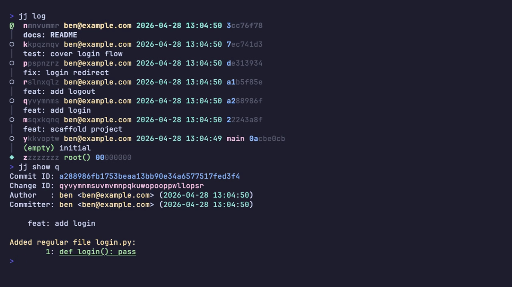

+++
title = 'jj: less friction, same Git'
date = 2026-04-24T12:51:27+10:00
draft = false
description = "A tour of Jujutsu (jj), a Git-compatible VCS that replaces the staging area with a commit-based working copy and stable change IDs."
categories = ['Software Engineering']
tags = ['tools', 'productivity', 'rust']
+++

Jujutsu has been frequently turning up in my feeds over the past year. Always
the same pattern: someone extolling its virtues, a workflow that'd be tedious in
Git, a flurry of unfamiliar syntax. I'd skim, disengage, return to Git. My
workflow is simple. It works. A rebase conflict ruins the odd morning, the odd
stash gets forgotten. But... that's just Git, right? Why should an old git like
me switch?

But the people praising `jj` kept being people I respect. So eventually I
stopped resisting and asked the question I should've asked first: what are the
key features of `jj` and how could it benefit me? I didn't know. So I sat down
with the docs., walked through some tutorials and watched some videos.

...and here we are!

[Jujutsu](https://github.com/jj-vcs/jj), or `jj` for short, is a Git-compatible
VCS from Martin von Zweigbergk, a Google engineer who works on source control.
It's written in Rust and rethinks several pieces of the workflow we'd all
quietly accepted as _just how version control works_.

Three frictions in particular: managing the staging area and stashes; working
around conflicts that lock the repo until you fix them; and rewriting history
without every reference to the rewritten work going stale. Each of these feels
normal in Git because we've drilled it into our hands. None of them have to be.
The rest of this post is `jj`'s answer to each, plus a few things the same model
seemingly unlocks for free.

This isn't a complete tour. It's the highlights I'd show to colleagues: the
handful of changes that actually matter when you sit down to write code on a
Monday morning. Every example below is real terminal output from `jj 0.40`. Flag
names occasionally shift between releases, so check `--help` if something
doesn't behave as described on a newer version.

## You can try it without telling anyone

Start here, because this is the part that makes the whole conversation
low-stakes.

`jj` runs on top of an existing Git repo. In _collocated mode_, both `.jj` and
`.git` directories live side-by-side in the same workspace. Push, fetch, and
pull still go through Git; `jj` literally subprocesses out to it. Your
colleagues see ordinary Git commits land on `main`. They don't need to install
anything, change anything, or even know.

```text
$ cd my-existing-repo
$ jj git init --colocate
Done importing changes from the underlying Git repo.
Initialized repo in "."
Hint: Running `git clean -xdf` will remove `.jj/`!

$ ls -la
drwxr-xr-x  .git
drwxr-xr-x  .jj
-rw-r--r--  README.md
-rw-r--r--  app.py

$ jj log
@  muwywxon ben@example.com 2026-04-27 11:09:33 95a4fc38
│  (empty) (no description set)
○  llmvnvnq ben@example.com 2026-04-27 11:09:29 main af5da842
│  Add app skeleton
○  pslvosww ben@example.com 2026-04-27 11:09:23 96efe8c8
│  Initial commit
◆  zzzzzzzz root() 00000000
```

`jj` imported your existing history and put a fresh empty commit on top; that
empty commit is your working copy (more on that in a moment). The `main`
bookmark is preserved exactly where Git had it. And `git` itself still works in
the same folder:

```text
$ git log --oneline
af5da84 Add app skeleton
96efe8c Initial commit

$ git status
On branch main
nothing to commit, working tree clean
```

Behind the scenes, `jj` stores its extra metadata: change IDs, conflict
representations, operation log, as custom headers inside Git commit objects and
as files inside `.jj/`. The Git repo itself stays valid.

If you hit a corner of `git` that `jj` doesn't yet cover natively (some
submodule operations, for instance), drop into `git` in the same folder and use
it directly. The two tools coexist. There's no "jj-only" state you can get into
and not get out of.

There is no barrier to entry: no team migration, no infrastructure change, no
irreversible commitment. If you don't like it after a week, `rm -rf .jj`.

## The working copy is a commit

Here's the conceptual shift that initially broke my brain, in a useful way. It's
also the thing most likely to feel weird for the first day or two, so it's worth
spending time on.

In Git, the files you're editing in your editor and the files Git considers
"committed" live in different zones, and there's a third zone wedged between
them. Run `git status` and Git tells you which zone your changes are currently
sitting in:

```text
$ git status
Changes to be committed:           ← the INDEX (staged)
  modified:   foo.py

Changes not staged for commit:     ← the WORKING TREE
  modified:   bar.py
```

Three zones, three potentially different versions of the same file:

| Zone             | What it is                                    | What lives there                        |
| ---------------- | --------------------------------------------- | --------------------------------------- |
| **Working tree** | The files on disk that you edit               | Changes you've typed but not staged     |
| **Index**        | An invisible staging layer in `.git/index`    | Changes you've staged but not committed |
| **HEAD**         | A pointer to the latest commit on your branch | What was committed last time            |

Most Git commands exist to shuffle files between these zones: `git add` moves
working tree → index, `git commit` moves index → HEAD, `git stash` parks the
working tree and index somewhere else entirely. There are even three flavours of
`git diff` depending on which two zones you want to compare. Once your mind has
been bent into this shape you stop noticing the complexity, but any new
programmer has to internalise the model before they can use Git meaningfully.

In `jj`, the working copy _is_ a commit. Specifically, it's the commit pointed
to by `@`. Every command you run begins by snapshotting your filesystem changes
into that commit. There is no staging area. There is no `git add`. There is no
`git stash`. The mental model collapses from three states to one: a graph of
commits, with `@` marking the one you're currently editing.

This inverts the workflow. Instead of crafting a commit and then "saving" it,
you create the commit first, empty, and let your edits flow into it as you work.
Watch the commit ID change as the snapshot picks up new files, while the change
ID stays put:

```text
$ jj new -m "add greet function"
Working copy  (@) now at: yutvzxqz 5befacd2 (empty) add greet function

$ cat > greet.py <<EOF
def greet(name):
    return f"Hello, {name}!"
EOF

$ jj status
Working copy changes:
A greet.py
Working copy  (@) : yutvzxqz d4848436 add greet function
Parent commit (@-): mzowzptp 51953536 (empty) (no description set)
```

No `add`. No `commit`. The file is already in the commit, identified by the
change ID `yutvzxqz`. The commit ID changed from `5befacd2` (empty) to
`d4848436` (with the file); a content hash naturally moves when content moves.
The change ID didn't.

A small set of commands does an enormous amount of work:

- **`jj new`**: create a new empty commit on top of the current one (or on top
  of any revision you specify). Your "start something new."
- **`jj describe -m "..."`**: set or change the description of the current
  commit. Yes, you can describe a commit _after_ you've made it; the description
  is just metadata.
- **`jj squash`**: fold the current commit's changes into its parent. Useful
  when you've added "just one more thing" and realise it belongs with the
  previous commit.
- **`jj split`**: split the current commit into two. Interactively pick which
  hunks belong in the first commit, or pass file paths.
- **`jj edit <rev>`**: make `<rev>` the working copy. Now your edits flow into
  that commit directly. Your "go back and fix something."

Watch a real `split` followed by `squash`, paying attention to the change IDs:

```text
# You've added README.md alongside greet.py; they should be two commits.
$ jj split -m "add README" README.md
Selected changes : yutvzxqz 739c72c4 add README
Remaining changes: mquwsqup fc260c6f add greet function

$ jj log
@  mquwsqup ben@example.com 2026-04-27 11:11:39 fc260c6f
│  add greet function
○  yutvzxqz ben@example.com 2026-04-27 11:11:39 739c72c4
│  add README
○  ...

# Later, you add a docstring as a separate "wip" commit, then realise
# it belongs with the greet function commit.
$ jj new -m "wip docstring"
$ # ... edit greet.py to add a docstring ...
$ jj squash --use-destination-message
Working copy  (@) now at: vxpwwqnx 0fed7b3a (empty) (no description set)
Parent commit (@-)      : mquwsqup 0161b3ad add greet function
```

The `wip` commit is gone. Its changes folded into the `add greet function`
commit (`mquwsqup`), which kept its change ID even though its content, and
therefore its commit ID, changed.

The `--use-destination-message` flag tells squash to keep the parent's
description rather than open an editor to merge them. Without it, you'd get
prompted; this is the flag you'll start aliasing within a week.

There's one more command worth knowing because it's borderline magic:
`jj absorb`. Imagine you've got a stack of commits and your working copy
contains a mix of fixes; some belong with the first commit, some with the third.
In Git you'd reach for `commit --fixup` and `rebase --autosquash`, with all the
manual tagging that implies. In `jj`, you just run one command:

```text
$ jj diff
Modified regular file util.py:
   1    1: def add(a, b):
        2:     """Return the sum of a and b."""
   2    3:     return a + b
   3    4:
   4    5: def subtract(a, b):
        6:     """Return a minus b."""
   5    7:     return a - b
   6    8:
   7    9: def power(a, b):
       10:     """Return a raised to the power of b."""
   8   11:     return a ** b

$ jj absorb
Absorbed changes into 2 revisions:
  twmqpqnt bcb4fb5b add: power function
  ymzovsqs dd91aab0 add: arithmetic helpers
Rebased 2 descendant commits.
Working copy  (@) now at: uzyuxuyp b00caee9 (empty) wip: docstrings
Parent commit (@-)      : ownwrnxl 0392f2b6 (empty) (no description set)
```

`jj absorb` looked at each hunk in the working copy, found which ancestor commit
last touched those lines, and routed each change to the right place
automatically. The docstrings for `add` and `subtract` went into the commit that
originally created them; the docstring for `power` went into the commit that
introduced it. No manual tagging. No autosquash markers. Just figure out where
each piece belongs and put it there.

Notice the `Rebased 2 descendant commits` line in the output: once absorb edits
an ancestor, every commit above it auto-rebases onto the new content. Editing an
ancestor in `jj` always ripples through its descendants: a pattern you'll see
throughout the rest of this post.

**Pattern: replacing `git rebase --autosquash`.** Make all your fix-up edits in
your working copy, then `jj absorb`. Done.

That's the broader point: with every edit already in a commit, the "dirty
working copy" simply doesn't exist as a state to manage. Switching contexts with
unfinished work is a non-event. Forgotten stashes are a thing of the past
because there's nothing to stash; your half-finished work is already a commit
with a name you can return to.

**Pattern: replacing `git stash`.** When something pulls you off your work,
`jj new @-` creates a fresh empty commit at your parent (or `jj new main` if the
urgent work needs a different base). Your in-progress change stays exactly where
it was, identified by its stable change ID. Come back to it with
`jj edit <change-id>` whenever you're ready. No stash stack to maintain, no
`pop` to remember.

The deeper consequence is that _editing history becomes the default mode of
working_, not a heroic effort you summon courage for. You don't construct a
clean series of commits at the end; you build them incrementally, splitting and
squashing as you go.

## An undo button that actually works

Git has the reflog. It's better than nothing, but it's not exactly a friendly
safety net; you have to know it exists, know how to read its output, and
manually piece together what state you want to return to. A workflow I often
forget, and stuff up.

`jj` records every operation you've run in an _operation log_. Not just commits,
but commands: every `jj new`, every rebase, every bookmark move, every push. To
undo your last command:

```text
$ jj undo
```

That's the entire interface for the common case. Repeat it to step further back;
`jj redo` goes the other way. To see what happened:

```text
$ jj op log --limit 5
@  48272e21b917 ben@example.com default@ now, lasted 23 milliseconds
│  abandon commit 5f49187e26c4420662391620287cc69e07b96b9d and 1 more
│  args: jj abandon kvy zqk
○  fec6aead8831 ben@example.com default@ 5 seconds ago, lasted 17 milliseconds
│  snapshot working copy
│  args: jj log
○  13e2c507c93f ben@example.com default@ 5 seconds ago, lasted 17 milliseconds
│  new empty commit
│  args: jj new -m 'commit 4'
...
```

Every operation is there with the exact command you ran. To jump to any specific
point:

```text
$ jj op restore <op-id>
```

The repo state at every point is preserved completely: not just commit hashes
but bookmark positions, the working copy, conflicts, everything. Watch a real
recovery. Abandon two commits in the middle of a chain:

```text
$ jj abandon kvy zqk
Abandoned 2 commits:
  zqkzrtzn 5f49187e commit 3
  kvypmvrx c91caed6 commit 2
Rebased 1 descendant commits onto parents of abandoned commits

$ jj log
@  wztyzvww ben@example.com 2026-04-27 11:16:08 b2fbd114
│  commit 4
○  rsssnzkv ben@example.com 2026-04-27 11:16:03 d13b1ac0
│  commit 1
...
```

Commits 2 and 3 are gone. Commit 4 was rebased onto commit 1. One command
restores everything:

```text
$ jj undo
Undid operation: 48272e21b917 abandon commit 5f49187e26c4420662... and 1 more
Restored to operation: fec6aead8831 snapshot working copy

$ jj log
@  wztyzvww ben@example.com 2026-04-27 11:16:03 d71ff9a3
│  commit 4
○  zqkzrtzn ben@example.com 2026-04-27 11:16:03 5f49187e
│  commit 3
○  kvypmvrx ben@example.com 2026-04-27 11:16:03 c91caed6
│  commit 2
○  rsssnzkv ben@example.com 2026-04-27 11:16:03 d13b1ac0
│  commit 1
...
```

The operation log was apparently built to handle concurrency on Google's
distributed filesystems: multiple `jj` processes writing to the same repo
without corrupting it. Each operation produces a new node in a DAG; concurrent
operations produce parallel nodes that get merged. The "undo any command"
experience is a side effect of that design, which is part of why it's so robust.
It wasn't bolted on later as a UX feature.

A practical consequence: experimentation is genuinely cheap. Try a destructive
rebase to see if it works. If it doesn't, undo it. There's no "I should commit
first to be safe" anxiety: your previous state is already preserved, because
_every_ state is preserved.

## Stable change IDs survive everything

You've already seen this at work, but it's worth highlighting. Every example
above showed two IDs per commit: the familiar Git-style commit hash on the
right, and a separate change ID on the left. The commit hash changes whenever
the content does. The change ID is a stable logical identifier, assigned once
when the change is created, that follows a unit of work across rebases, amends,
and squashes.

That's why `mquwsqup` survived a `jj squash` in the example above: same change
ID, different commit hash. The pattern holds through every rewrite operation in
the sections that follow: rebases, conflict resolutions, splits, anything. In
`jj log`, the unique prefix of the change ID is highlighted so the part you can
actually type stands out, and sometimes that's just a single character:



For anyone who lives in `git rebase -i`, this alone is worth the install:
references in your shell history, scripts, and chat messages stop going stale
every time you rewrite history.

## Conflicts stop being emergencies

In Git, a merge conflict blocks everything. The repo enters a special state, you
see `<<<<<<<` markers in your files, your branch is "in the middle of a merge,"
and you can't do much else until you resolve it. Half the time you abandon the
merge to deal with whatever urgent thing came up.

`jj` records the conflict directly in the commit. The commit is still a valid,
complete object. It just contains, alongside its file contents, the three input
trees of the merge: the common ancestor (base), and the two competing sides.
Files with conflicts get markers written to your working copy so you can edit
them, but the _commit itself_ knows the structured history of how it became
conflicted. The repo never enters a special "halfway" state.

Watch a real divergent rebase. You have `feat: bump TIMEOUT to 60` based on an
older `main`. Meanwhile, `main` moved forward with its own change to the same
line:

```text
$ jj log
@  rvkvvsyl ben@example.com 2026-04-27 15:18:51 main 60406fbc
│  main: change TIMEOUT to 45
│ ○  oxryrypv ben@example.com 2026-04-27 15:18:51 feature 0f3779d8
├─╯  feat: bump TIMEOUT to 60
○  ymnymzww ben@example.com 2026-04-27 15:18:50 7cfb8db2
│  initial config
◆  zzzzzzzz root() 00000000

$ jj rebase -s feature -d main
Rebased 1 commits to destination
New conflicts appeared in 1 commits:
  oxryrypv cf1faeef feature | (conflict) feat: bump TIMEOUT to 60
Hint: To resolve the conflicts, start by creating a commit on top of
the conflicted commit:
  jj new oxryrypv
Then use `jj resolve`, or edit the conflict markers in the file directly.
```

The rebase finished. Look at the log:

```text
$ jj log
×  oxryrypv ben@example.com 2026-04-27 15:18:51 feature cf1faeef (conflict)
│  feat: bump TIMEOUT to 60
@  rvkvvsyl ben@example.com 2026-04-27 15:18:51 main 60406fbc
│  main: change TIMEOUT to 45
○  ymnymzww ben@example.com 2026-04-27 15:18:50 7cfb8db2
│  initial config
◆  zzzzzzzz root() 00000000
```

The conflicted commit is marked `×`. The `(conflict)` label sits right there in
the log. Your working copy (`@`) is on a clean `main`; you're not "in the middle
of a rebase," you're just somewhere else in a healthy repo. From here you can:

- **commit on top of the conflicted commit**: the new commit inherits the
  conflict until it's resolved
- switch to another branch entirely and come back later
- rebase the conflicted commit onto yet another parent
- resolve the conflict whenever you actually have time

When you do resolve it, `jj` shows the inputs in the conflict markers, not just
the two sides:

```text
$ jj new feature
$ cat config.py
<<<<<<< conflict 1 of 1
%%%%%%% diff from: ymnymzww 7cfb8db2 "initial config" (parents of rebased revision)
\\\\\\\        to: rvkvvsyl 60406fbc "main: change TIMEOUT to 45" (rebase destination)
-TIMEOUT = 30
+TIMEOUT = 45
+++++++ oxryrypv 0f3779d8 "feat: bump TIMEOUT to 60" (rebased revision)
TIMEOUT = 60
>>>>>>> conflict 1 of 1 ends
RETRIES = 3
```

The markers tell you exactly which commits are involved and what diff was being
applied. After fixing the file, fold the resolution back into the conflicted
parent; the squash _is_ the resolution step, and the final output line confirms
the conflict cleared:

```text
$ # ... edit config.py to TIMEOUT = 60 ...
$ jj squash --use-destination-message
Working copy  (@) now at: zoqlrqvz ae21e614 (empty) (no description set)
Parent commit (@-)      : oxryrypv a40a3525 feat: bump TIMEOUT to 60
Existing conflicts were resolved or abandoned from 1 commits.
```

That's the basic workflow. The deeper achievement: **fixing an old commit
shouldn't mean re-resolving every conflict it caused downstream**. In Git,
that's exactly what it means; you own every conflict the fix produces in every
descendant, even the obvious ones, by hand. In `jj`, conflicts that become
trivial after the upstream fix resolve themselves. You only handle the ones that
are genuinely ambiguous.

This works because conflicts are stored as their symbolic inputs rather than as
resolved text, so the terms can cancel out when the right change lands upstream.

Rewind to right after the rebase, with `feature` still conflicted. Suppose you
realise the right answer is that `main` should also have been on `TIMEOUT = 60`.
Edit `main` directly:

```text
$ jj edit main
$ # ... change config.py to TIMEOUT = 60 ...
$ jj describe -m "main: bump TIMEOUT to 60"
Rebased 1 descendant commits onto updated working copy
Rebased 1 descendant commits
Working copy  (@) now at: rvkvvsyl 6cfe6278 main | main: bump TIMEOUT to 60
Parent commit (@-)      : ymnymzww 7cfb8db2 initial config

$ jj log
○  oxryrypv ben@example.com 2026-04-27 15:18:56 feature 49e0e020
│  (empty) feat: bump TIMEOUT to 60
@  rvkvvsyl ben@example.com 2026-04-27 15:18:56 main 6cfe6278
│  main: bump TIMEOUT to 60
○  ymnymzww ben@example.com 2026-04-27 15:18:50 7cfb8db2
│  initial config
◆  zzzzzzzz root() 00000000
```

The `×` glyph is gone. The `(conflict)` label is gone. `feature` is now
`(empty)` because both sides ended up at the same value; its change is genuinely
redundant. Nothing prompted you to resolve anything; you just edited the
upstream commit and the conflict evaporated.

The first time you watch this happen during a rebase, you'll think you broke
something.

## Bookmarks aren't branches

This is the section that surprised me, and the one most likely to trip you up in
the first week, so it's worth setting up the mental model before showing the
surprising behaviour.

In `jj`, bookmarks are for _publishing_ work. They're how you say "this specific
commit is the tip of feature X" when you push to a remote or signal to
teammates. They are not for tracking your in-progress work; that job belongs to
change IDs, which are stable across rewrites.

Once that distinction is in your head, the actual behaviour follows: **bookmarks
don't move when you commit.** In Git, `git checkout -b feature` creates a branch
that automatically follows your subsequent commits. In `jj`, you create a
bookmark at a revision, you make commits, and the bookmark stays exactly where
you put it. Your new commits exist as "anonymous heads", tracked perfectly fine
by their change IDs, visible in `jj log`, but not labelled with a bookmark name:

```text
$ jj bookmark create feature -r @
Created 1 bookmarks pointing to ywxuqwpk e2253ea6 feature | (empty) feature work

$ # ... two more commits later ...
$ jj log
@  zylstvow ben@example.com 2026-04-27 15:16:17 3d2cfe79
│  (empty) even more work
○  uszmoklr ben@example.com 2026-04-27 15:16:17 d30ac26b
│  (empty) more work
○  ywxuqwpk ben@example.com 2026-04-27 15:16:17 feature e2253ea6
│  (empty) feature work
○  lzlswntt ben@example.com 2026-04-27 15:16:17 main fa82aa58
│  (empty) initial
◆  zzzzzzzz root() 00000000
```

The `feature` bookmark is still on `ywxuqwpk`, the commit it was created at, two
commits behind where you're actually working. It didn't follow you. That's fine:
the new commits aren't lost, they're identified by their change IDs (`uszmoklr`,
`zylstvow`). When you're ready to say "this revision is now what 'feature'
means," move the bookmark explicitly and push:

```text
$ jj bookmark move feature --to @
Moved 1 bookmarks to zylstvow 3d2cfe79 feature* | (empty) even more work

$ jj git push -b feature
```

The decoupling has real benefits. Force-pushing because you rebased? Doesn't
exist as a concept; you just move the bookmark to the new commit and push.
Accidentally committing on the wrong branch? Doesn't happen, because no branch
silently follows your edits. Maintaining ten experimental branches in parallel?
Each one is just a bookmark; the underlying commits are all there in the graph,
and you navigate by change ID, not by checking out branches.

It does require unlearning. The first few times you push and find the remote
bookmark isn't where you expect it, you'll wonder where Git went.

**Pattern: keeping a bookmark on your tip.** If the manual move grates,
[the community alias `jj tug`](https://shaddy.dev/notes/jj-tug/) finds the
nearest ancestor bookmark and moves it to your parent: closer to Git's
auto-following behaviour, without giving up the rest of the model. Add to
`~/.config/jj/config.toml`:

```toml
[aliases]
tug = ["bookmark", "move", "--from", "heads(::@- & bookmarks())", "--to", "@-"]
```

## Stacked PRs become trivial

Anyone who's tried to maintain a stack of dependent PRs in Git knows the pain:
rebasing the bottom of the stack means manually rebasing every branch above it,
force-pushing each one, and hoping you don't lose track of which branch points
where. People install whole tools: Graphite, Sapling, homebrew wrappers around
`git rebase --onto` to manage this.

In `jj`, this is just how things work. Each PR is a bookmark on a specific
change. Editing any commit in the stack triggers an automatic rebase of every
descendant, with all bookmarks moving with their changes:

```text
# starting state: three dependent bookmarks
$ jj log
@  uknymnrm ben@example.com 2026-04-27 12:16:15 stack/03-handler 2d9a1ab4
│  feat: wire into handler
○  xvlmsouu ben@example.com 2026-04-27 12:16:15 stack/02-parsing 1c881862
│  feat: add input parsing
○  vmxyswyk ben@example.com 2026-04-27 12:16:15 stack/01-validators 5e9ddaa8
│  feat: extract validators
○  lomysskv ben@example.com 2026-04-27 12:16:14 main d06d6ea1
│  (empty) initial

# realised the bottom commit needs a fix
$ jj edit vmx
$ # ... edit validator.py ...
$ jj new uknymnrm    # back to the top of the stack

$ jj log
@  kywnvvok ben@example.com 2026-04-27 12:16:24 afb29b4d
│  (empty) (no description set)
○  uknymnrm ben@example.com 2026-04-27 12:16:24 stack/03-handler 3c3f7fd4
│  feat: wire into handler
○  xvlmsouu ben@example.com 2026-04-27 12:16:24 stack/02-parsing e65679be
│  feat: add input parsing
○  vmxyswyk ben@example.com 2026-04-27 12:16:24 stack/01-validators ae6dbcd2
│  feat: extract validators
○  lomysskv ben@example.com 2026-04-27 12:16:14 main d06d6ea1
│  (empty) initial
```

All three bookmarks moved with their changes; same change IDs, new commit IDs.
Pushing the entire stack to GitHub is one command:

```text
$ jj git push -b 'glob:stack/*'
Changes to push to origin:
  Add bookmark stack/01-validators to ae6dbcd20e8d
  Add bookmark stack/02-parsing to e65679be1dfe
  Add bookmark stack/03-handler to 3c3f7fd42659
```

**Pattern: deferred PR organisation.** Bookmarks don't follow your work, so you
don't need to know the PR shape upfront. Work freely; once the boundaries are
obvious, mark them retroactively with
`jj bookmark create -r <change-id> <name>`. Git's "branch first, then commit"
order inverts: write the code, _then_ decide what the PRs are.

**Pattern: pushing a stack.** `jj git push -b 'glob:<prefix>/*'` pushes every
bookmark matching the pattern. Combined with auto-rebase, stack maintenance
becomes built-in.

The reason this feels instant is that `jj` does history rewrites in memory
rather than thrashing the working copy on every step. It also rebases entire
trees at once, not just linear chains: if you have a stack A → B → C with a side
branch D → E rooted at A, a single `jj rebase -s A -d main` moves the whole
structure. Combined with auto-rebase of descendants when you edit an ancestor,
the "ripple my fix through every dependent change" workflow that's painful in
Git becomes the default. You stop avoiding history edits because they're cheap.

## Day-to-day with a team

`jj git fetch` updates your view of remote bookmarks, much like `git fetch`. The
common case from there: `main` moved while you were stacking changes, and you
want to drag the stack onto the new tip.

```text
$ jj git fetch
bookmark: main@origin [updated] tracked

$ jj log
@  kywnvvok ben@example.com 2026-04-27 12:16:24 afb29b4d
│  (empty) (no description set)
○  uknymnrm ben@example.com 2026-04-27 12:16:24 stack/03-handler 3c3f7fd4
│  feat: wire into handler
○  xvlmsouu ben@example.com 2026-04-27 12:16:24 stack/02-parsing e65679be
│  feat: add input parsing
○  vmxyswyk ben@example.com 2026-04-27 12:16:24 stack/01-validators ae6dbcd2
│  feat: extract validators
│ ◆  tuouzktx ben@example.com 2026-04-29 15:00:41 main c15b66ea
├─╯  main: add deployment notes
◆  lomysskv ben@example.com 2026-04-27 12:16:14 d06d6ea1
│  (empty) initial
~
```

Stack on the old base, fetched `main` ahead. One rebase moves the whole stack
across:

```text
$ jj rebase -s stack/01-validators -d main
Rebased 4 commits to destination
Working copy  (@) now at: kywnvvok e8bb6721 (empty) (no description set)
Parent commit (@-)      : uknymnrm 47a2ecdf stack/03-handler* | feat: wire into handler
Added 1 files, modified 0 files, removed 0 files

$ jj log
@  kywnvvok ben@example.com 2026-04-29 15:01:13 e8bb6721
│  (empty) (no description set)
○  uknymnrm ben@example.com 2026-04-29 15:01:13 stack/03-handler* 47a2ecdf
│  feat: wire into handler
○  xvlmsouu ben@example.com 2026-04-29 15:01:13 stack/02-parsing* eaee9431
│  feat: add input parsing
○  vmxyswyk ben@example.com 2026-04-29 15:01:13 stack/01-validators* 7ad7906f
│  feat: extract validators
◆  tuouzktx ben@example.com 2026-04-29 15:00:41 main c15b66ea
│  main: add deployment notes
~
```

Source the bottom of the stack and the rest comes with it: the three named
bookmarks plus the empty working copy at the top, all in one move (hence
`Rebased 4 commits`). Same change IDs (left column), new commit IDs (different
parent, different content hash). The `*` after each stack bookmark name signals
divergence from origin, so push when you're ready. If a commit conflicts with
the new `main`, it gets the conflict-as-data treatment from earlier: marked,
queued, never blocking the rebase.

There is no `jj git pull`. Fetch and rebase are deliberately separate steps: you
see what upstream did before you decide when to move your work onto it.

## Your history is queryable

Almost every command takes a `-r` flag that accepts not a single revision, but
an expression in `jj`'s revset language. Real queries against a small graph:

```text
$ jj log -r 'description(substring:"TODO") | description(substring:"WIP")'
@  xxkqumvp ben@example.com 2026-04-27 11:17:11 9b8b7edf
│  (empty) WIP: experiment
~

○  qsortqsv ben@example.com 2026-04-27 11:17:11 0d5daeb5
│  (empty) TODO: review error messages
~
```

That's "show me anything marked WIP or TODO across the entire repo." Or:

```text
$ jj log -r 'mine() ~ ::main'
@  xxkqumvp ben@example.com 2026-04-27 11:17:11 9b8b7edf
│  (empty) WIP: experiment
○  pnvonuxv ben@example.com 2026-04-27 11:17:11 30c086d7
│  (empty) fix: typo in README
~

○  qsortqsv ben@example.com 2026-04-27 11:17:11 0d5daeb5
│  (empty) TODO: review error messages
○  wwnrqqvz ben@example.com 2026-04-27 11:17:11 6b16d0f4
│  (empty) feat: add logout
○  xvopuors ben@example.com 2026-04-27 11:17:11 c2a02731
│  (empty) feat: add login
~
```

"My commits not yet on main." Read `~` as set difference and `::main` as "all
ancestors of main, including main." Or:

```text
$ jj log -r 'description(glob:"feat:*")'
○  wwnrqqvz ben@example.com 2026-04-27 11:17:11 6b16d0f4
│  (empty) feat: add logout
○  xvopuors ben@example.com 2026-04-27 11:17:11 c2a02731
│  (empty) feat: add login
~
```

Glob-match anything starting with `feat:`. The same expressions work in
`jj log`, `jj rebase`, `jj abandon`, `jj edit`, anywhere a revision is accepted:

```text
$ jj rebase -s 'descendants(xrq)' -d main
$ jj abandon 'description(substring:"WIP")'
```

In Git, the equivalent is some unholy combination of `git log --grep`,
`git rev-list`, `awk`, and tears. In `jj`, it's part of the daily interface, and
it turns "what's the state of my repo" from an interpretive exercise into a
query.

## Where I think it pays off

Take the rest of this section as one engineer's view. A few weeks of my own use
plus patterns I have heard from people deeper in. If any of these sound like
you, the payoff curve looks good:

- **Heavy history editors**: if you spend more than fifteen minutes a week in
  `git rebase -i`, or maintain stacks of dependent PRs, the in-memory rebase
  speed and stable change IDs compound from day one.
- **Engineers in conflict-prone codebases**: large teams, monorepos, frequent
  cross-branch merges. Conflicts as data, non-blocking and often self-resolving,
  turns the most painful part of your week into background work.
- **Experimenters**: if you routinely try two or three approaches before picking
  one, the operation log makes every dead end a free `jj undo` away.
  Experimentation stops feeling expensive.
- **AI-assisted coders**: every model iteration is automatically snapshotted
  into a commit; the operation log captures every agent-driven command. After a
  long Claude or Cursor session, `jj op log` gives you a blow-by-blow of what
  the agent actually did, and `jj undo` rolls back the last operation no matter
  how many files it touched. The "I should commit before letting the agent
  loose" anxiety disappears, because the safety net is automatic.

## Where I'd hold off

I'd be doing you a disservice if I only listed wins. Same caveat — inferences,
not verdicts:

- **If your daily workflow is `git pull`, `git commit`, `git push`**, and you
  don't care about clean history, `jj` won't change much for you. The benefits
  cluster around history editing, conflict-heavy work, and complex branching.
- **If you're a merge-everywhere developer**: sync via merge from the parent
  branch, no-fast-forward merge into the parent on PR, never review individual
  commits: the rebase-heavy wins (stacks, change IDs across rewrites,
  auto-rebase) won't matter much. The staging-area, undo, and conflict-as-data
  benefits still do, but the marginal value over your current Git workflow is
  smaller. (A colleague made this case to me after a recent talk; he was right.)
- **If you're a solo dev on small personal projects**, the muscle-memory cost
  probably outweighs the gains.
- **If you're a deeply habit-bound Git veteran**, expect a real adjustment
  period. The "create the commit before it's ready" inversion takes a couple of
  weeks to feel natural. The bookmark-doesn't-move-with-you behaviour will bite
  you a few times. Some people bounce off it.

There are rough edges, too. Submodule support is incomplete; LFS handling is
behind. Editor and IDE integrations lag Git significantly: most of the
third-party tooling ecosystem (PR tools, GUI clients, code review integrations)
assumes Git. The community is small but active. The docs are improving but
you'll occasionally need to read the source.

## Give it a week

Try it on a side branch this week. Worst case, you understand Git better by
contrast.

## Further reading

If this convinced you to try `jj`, the canonical resources:

- [The jj-vcs project on GitHub](https://github.com/jj-vcs/jj): official docs
  are linked from the README and have improved enormously over the past year.
- [The design docs in the project repo](https://github.com/jj-vcs/jj/tree/main/docs),
  separate from the user-facing CLI reference; it explains _why_ the model is
  the way it is. Worth reading after you've used `jj` enough to wonder.
- [Steve Klabnik's "Jujutsu Tutorial"](https://steveklabnik.github.io/jujutsu-tutorial/):
  the friendliest hands-on introduction, written by someone who came to `jj`
  from a deep Git background.
- [Chris Krycho's "jj init" essay series](https://v5.chriskrycho.com/essays/jj-init/):
  long-form, opinionated, and the best explanation of `jj`'s design philosophy
  I've found. Worth seeking out on his blog.
- [Kuba Martin's "Introduction to the Jujutsu VCS"](https://kubamartin.com/posts/introduction-to-the-jujutsu-vcs/):
  names `jj`'s workflows as patterns and shows several non-obvious recipes I
  borrowed from while writing this post.
